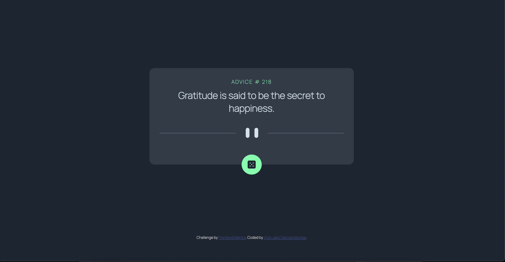

# Frontend Mentor - Advice generator app solution

This is a solution to the [Advice generator app challenge on Frontend Mentor](https://www.frontendmentor.io/challenges/advice-generator-app-QdUG-13db). Frontend Mentor challenges help you improve your coding skills by building realistic projects.

## Table of contents

- [Overview](#overview)
  - [The challenge](#the-challenge)
  - [Screenshot](#screenshot)
  - [Links](#links)
- [My process](#my-process)
  - [Built with](#built-with)
  - [What I learned](#what-i-learned)
  - [Continued development](#continued-development)
- [Author](#author)


## Overview

### The challenge

Users should be able to:

- View the optimal layout for the app depending on their device's screen size
- See hover states for all interactive elements on the page
- Generate a new piece of advice by clicking the dice icon

### Screenshot



### Links

- Live Site URL: [Add live site URL here](https://your-live-site-url.com)

## My process

### Built with

- Semantic HTML5 markup
- CSS custom properties
- Flexbox
- CSS Grid
- Mobile-first workflow
- Vanilla JavaScript

### What I learned

Learned how to use fetch on vanilla Javascript, produ of myself here cuz I barely google naything regarding the fetch call and the DOM manipulation

```js
const getAdvice = () => {
  fetch("https://api.adviceslip.com/advice")
    .then((response) => response.json())
    .then((data) => {
      const adviceId = document.getElementById("advice-id");
      adviceId.innerHTML = data.slip.id;
      const adviceBody = document.getElementById("advice-text");
      adviceBody.innerHTML = data.slip.advice;
    })
    .catch((error) => {
      console.log("Error", error);
    });
};
```

### Continued development

Future projects will try to implement better the CSS , gotta study more about positioning, maybe migrate this project to React JS

## Author

- Website - [Jhon Jairo Garces Montes](https://www.your-site.com)

